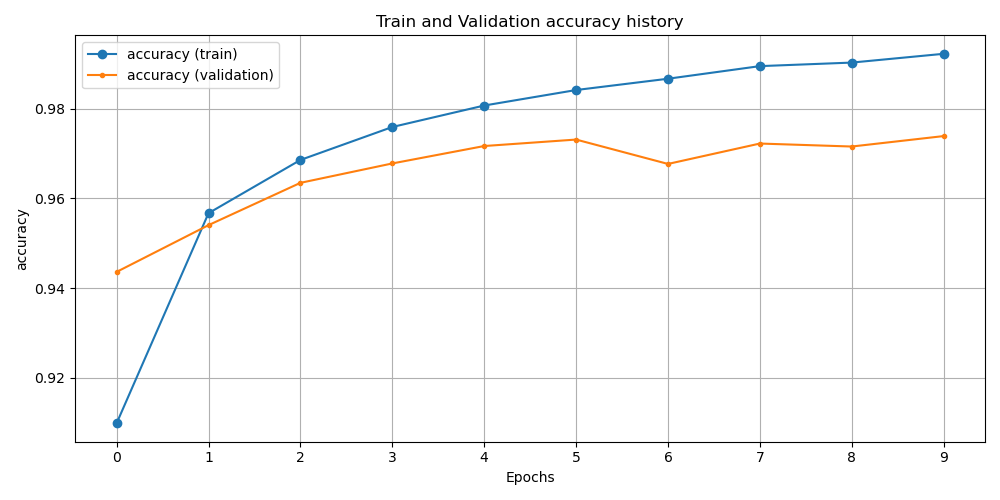

# Machine Learning Experiment Framwork
This framework attempts to streamline the machine learning research process to enable
- zero effort reproducability
- a single source of truth for the definition of which arguments are allowed for which dataset, ML-model etc. 
- IntelliSense for available arguments for a specific experiment, model, dataset etc. including type validation through Pydantic
- code reusability (metrics tracking, training loop, model checkpointing, checkpoint loading, wandb logging, early stopping, ... are available per default for all experiments)
- collaboration through a proper software architecture instead of copy paste experimenting while still allowing for quick "out of framework" scripting ([wild-west](.src/wild-west)), optionally reusing Dataset and Deep Learning Model modules
- zero effort logging and history plotting

The assumptions to achieve this are that all experiment share some basic logic. 
They all have a 
- ML model (here a pytorch Module with an additional interface)
- Dataset
- train loop with a specified number of epochs
- an optimizer
- a scheduler

The idea is that all of these previously listed concepts follow an extendable base interface for the corresponding concept so that the framework can work with them (e.g. BaseModel, BaseDataset, ..).
Each of these Modules also has their own Pydantic Model, which specifies its variables. In the specific experiment using the modules, the Pydantic Models are sticked together and a Vanilla Python ArgParser is constructed automatically from the Pydantic model.
For arguments that do not change across experiments such as API keys etc., a yaml config is used.
For demonstration purposes, an experiment for MNIST (handwritten digit classification) is implemented.

## Getting started
1. Fork this repository
2. Create conda environment from `environment.yaml`: `conda env create --file environment.yaml`
3. Run MNIST experiment via e.g.`python run.py --experiment_id=mnist --use_cuda=false --hidden_sizes="[64]"`, you'll be prompted to fill out a config YAML to specify directories for cache files and the experiment results. Per default, they will be put in `cache` and `results` directories within the working directory. If you want to keep it that way, just run the experiment again. Within the config.yaml there will also be WandB attributes which you do not have to change unless you're running experiments with `--use_wandb=true`
4. Run the command again, training should run and you should see the experiment results in the specified folder: example history.png: 

## Adding a new experiment
1. Either choose a reference experiment, i.e. [mnist_experiment.py](src/experiments/mnist_experiment.py) and copy it to `src/experiments/[new_experiment_filename].py` OR create a new file and implement all abstract methods of the [Base Experiment interface](src/experiments/base_experiment.py) within a new BaseExperiment subclass.  
2. Register your experiment in the [Experiment Registry file](src/args/experiment_registry.py)
3. Run experiment via `python run.py --experiment_id=[EXPERIMENT_ID] [OTHER_ARGUMENTS...]`